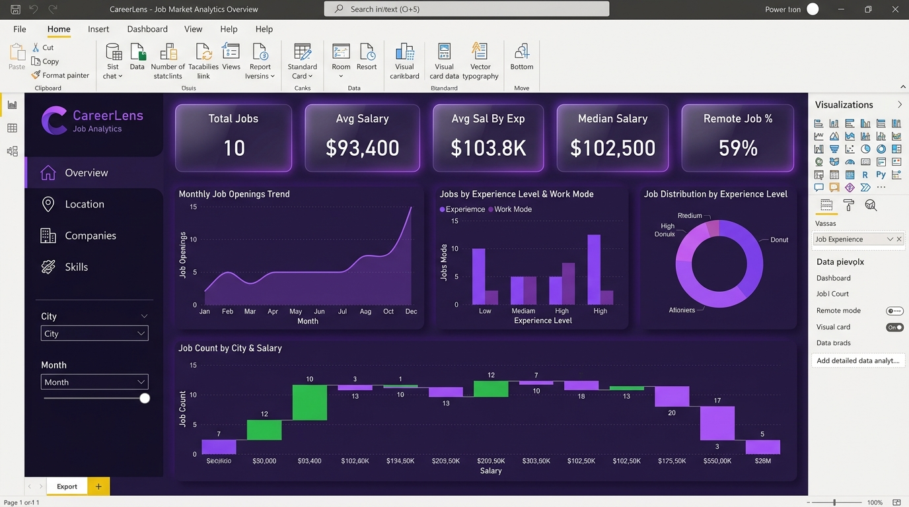
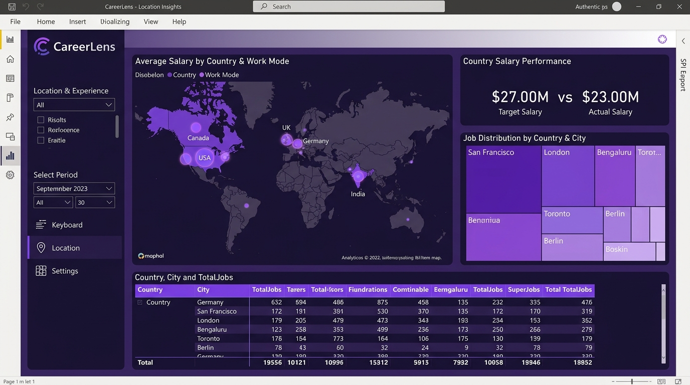
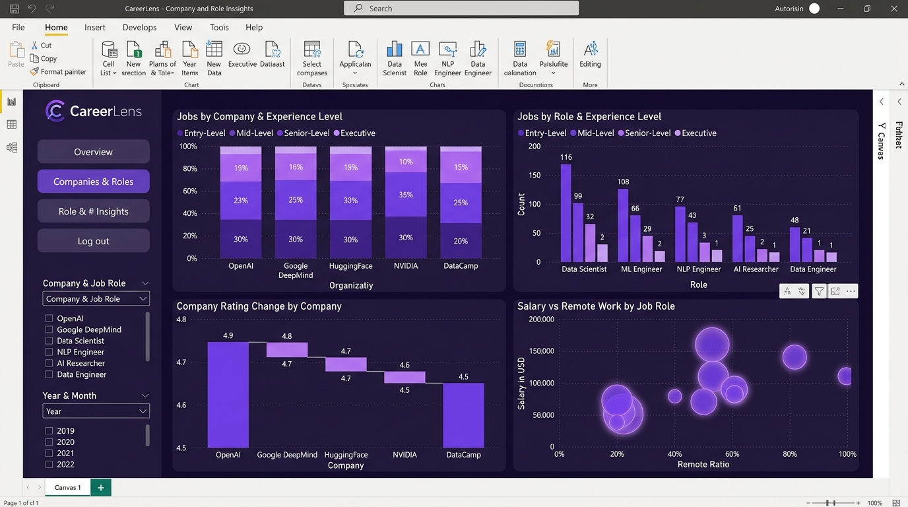
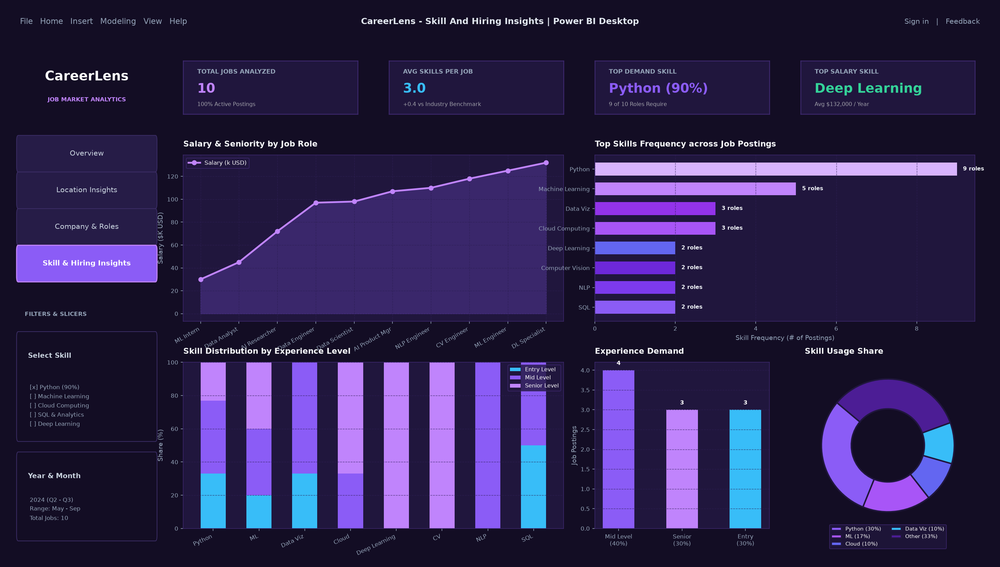
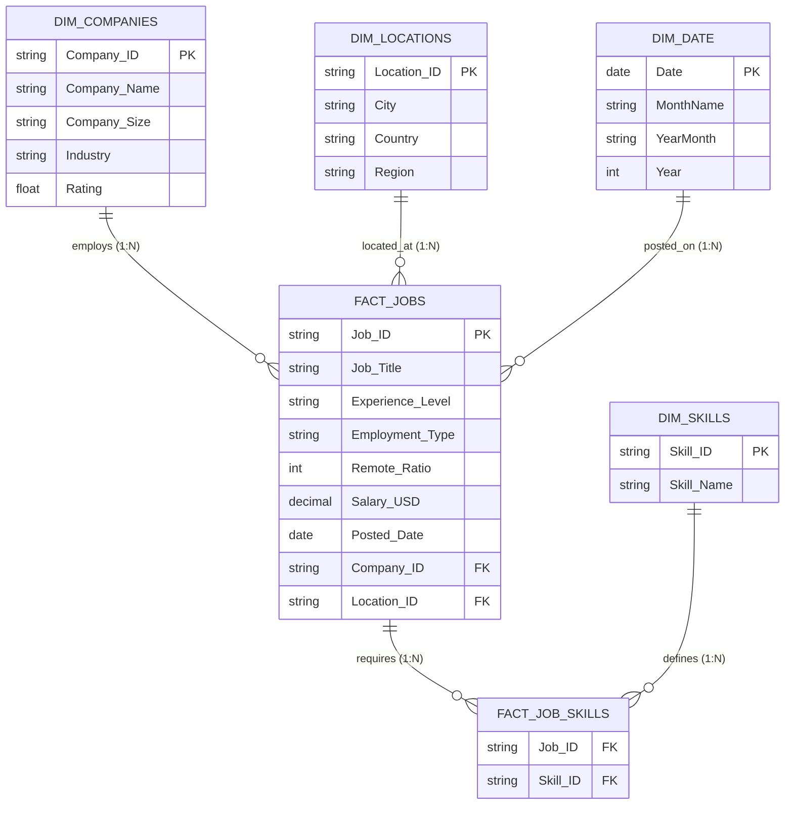

<div align="center">

# 🔮 CareerLens — AI & Tech Job Market Analytics

### *Transforming Global Tech Labor Data into Strategic Talent & Compensation Intelligence*

[](https://powerbi.microsoft.com/)
[](https://learn.microsoft.com/en-us/dax/)
[](#-data-model--star-schema-architecture)
[](https://www.python.org/)
[](LICENSE)
[](https://github.com/sujalpanchal-25)

<br/>


<br/>

**[📊 Live Screenshots](#-dashboard--report-gallery)** •
**[🧠 Key Insights](#-executive-summary--market-findings)** •
**[🏗️ Architecture](#-data-model--star-schema-architecture)** •
**[📐 DAX Measures](#-dax-measures--analytical-formulas)** •
**[🚀 Setup Guide](#-quick-start--setup-guide)**

---

</div>

## 📌 Executive Summary

**CareerLens** is an end-to-end, multi-page business intelligence and data analytics suite developed in **Microsoft Power BI**. Designed for tech leaders, hiring managers, talent strategists, and candidates, it delivers actionable clarity on the rapidly evolving artificial intelligence, machine learning, and data science job markets.

Through an intuitive, cyber-purple glassmorphic interface, CareerLens deciphers hiring demand across top AI innovators (**OpenAI, Google DeepMind, HuggingFace, NVIDIA, DataCamp**), mapping global salary variance, remote flexibility adoption, experience-level requirements, and skill stack prerequisites.

---

## ⚡ High-Level Market KPIs

<div align="center">

| 💼 Analyzed Roles | 💰 Average Salary | 🎯 Median Salary | 🚀 Max Comp Peak | 🌐 Remote Ratio | 👑 Top Skill Moat |
| :---: | :---: | :---: | :---: | :---: | :---: |
| **10 Positions** | **$93,400 / yr** | **$102,500 / yr** | **$132,000 / yr** | **59% Remote** | **Python (90%)** |

</div>

---

## 📸 Dashboard & Report Gallery

The Power BI report contains **4 distinct analytical pages** equipped with dynamic cross-filtering, bookmark navigation, slicers, and interactive drill-downs.

---

### 1️⃣ Page 1: Executive Overview Dashboard
> *A bird's-eye view of macro employment metrics, experience segmentation, hiring timelines, and regional compensation variance.*

<div align="center">
  
</div>

#### 🔍 Key Visual Elements:
- **KPI Stat Cards**: Instant readouts for *Total Jobs (10)*, *Average Salary ($93.4K)*, *Average Salary by Experience ($103.8K)*, *Median Salary ($102.5K)*, and *Remote Job % (59%)*.
- **Monthly Job Openings Trend (Line Chart)**: Tracks volume fluctuations across hiring cycles from May through September 2024.
- **Jobs by Experience Level & Work Mode (Clustered Column)**: Highlights remote vs. hybrid/on-site distributions for Entry, Mid, and Senior positions.
- **Job Distribution by Experience (Donut Chart)**: Visualizes the seniority split (**Mid-Level 40%**, **Senior 30%**, **Entry-Level 30%**).
- **Job Count by City & Salary (Waterfall Chart)**: Illustrates how salary benchmarks build up across global hubs from Bengaluru to San Francisco.
- **Sidebar Slicers**: Instant filtering by *City* and *Month* with smooth bookmark navigation.

---

### 2️⃣ Page 2: Location & Geographic Compensation Insights
> *Geospatial intelligence analyzing geographical pay disparities, regional headcount density, and cross-border salary efficiency.*

<div align="center">
  
</div>

#### 🔍 Key Visual Elements:
- **Global Choropleth & Bubble Map Visual**: Displays average salary levels across key tech territories (**North America, Europe, Asia**) with bubble radii scaled by compensation magnitude.
- **Country Salary Performance (KPI Gauge)**: Evaluates compensation performance against targeted industry baselines.
- **Job Distribution by Country & City (Treemap)**: Hierarchical decomposition showcasing talent concentration in San Francisco (USA), London (UK), Bengaluru (India), Toronto (Canada), and Berlin (Germany).
- **Country, City & TotalJobs Matrix**: Deep multi-level pivot grid detailing total roles, seniority breakdowns, and average compensation by geography.
- **Sidebar Slicers**: Multi-select filtering for *Region*, *Country*, and *Reporting Period*.

---

### 3️⃣ Page 3: Company & Role Insights
> *Competitive employer intelligence dissecting hiring profiles, company ratings, remote openness, and role-specific compensation.*

<div align="center">
  
</div>

#### 🔍 Key Visual Elements:
- **Jobs by Company & Experience Level (100% Stacked Column)**: Analyzes talent seniority distribution across industry leaders:
  - **Google DeepMind**: Heavy focus on Senior ML Engineers and Senior Computer Vision Specialists.
  - **OpenAI**: Balanced hiring across Mid Data Scientists and AI Product Managers.
  - **NVIDIA**: High-leverage Senior Deep Learning Specialists and Mid NLP Engineers.
  - **HuggingFace**: Ground-floor investment in Entry AI Researchers and ML Interns.
  - **DataCamp**: Core data infrastructure across Data Engineers and Data Analysts.
- **Jobs by Role & Experience Level (Clustered Column Chart)**: Headcount breakdown grouped by job family and career stage.
- **Company Rating Change (Waterfall Chart)**: Correlates Glassdoor/internal satisfaction ratings (ranging from 4.5 to 4.9) across enterprises.
- **Salary vs. Remote Work by Job Role (Scatter Plot)**: Multi-dimensional bubble matrix plotting *Remote Ratio (%)* vs. *Salary (USD)* with bubble size indicating required *Skill Usage Count*.

---

### 4️⃣ Page 4: Skill Demands & Hiring Dynamics
> *Technical competency analysis identifying essential programming languages, ML specializations, and skill-to-compensation correlations.*

<div align="center">
  
</div>

#### 🔍 Key Visual Elements:
- **Top Competency Cards**: Highlights *Total Jobs (10)*, *Avg Skills Required per Role (3.0)*, *Top Moat Skill (Python @ 90%)*, and *Highest-Paid Skill Specialization (Deep Learning @ $132,000)*.
- **Salary & Seniority Curve by Role (Spline & Area Chart)**: Visual progression of earnings starting from ML Intern ($30K) up to Deep Learning Specialist ($132K).
- **Top Skills Frequency (Horizontal Bar Chart)**: Clear ranking of market requirements: **Python (9)**, **Machine Learning (5)**, **Cloud Computing (3)**, **Data Visualization (3)**, and **Deep Learning / NLP / CV / SQL (2 each)**.
- **Skill Distribution by Experience Level (100% Stacked Bar)**: Pinpoints when skills become mandatory (e.g., Cloud & Deep Learning surge in Senior roles, while SQL and Python dominate Entry/Mid).
- **Skill Usage Share (Modern Donut Chart)**: Percentage representation of overall skill mentions across active job postings.

---

## 🏗️ Data Model & Star Schema Architecture

CareerLens is built on an enterprise-ready **Star Schema** dimensional model, engineered to eliminate redundancy, maximize DAX processing efficiency, and empower fluid cross-filtering across tables.



### 📋 Data Dictionary

| Table Name | Entity Type | Primary / Foreign Key | Description |
| :--- | :--- | :--- | :--- |
| **`Fact_Jobs`** | Fact Table | `Job_ID` (PK), `Company_ID` (FK), `Location_ID` (FK) | Core transactional table containing salary, experience level, remote ratio, and post dates. |
| **`Dim_Companies`** | Dimension Table | `Company_ID` (PK) | Corporate metadata including name, industry segment, enterprise size, and employee rating. |
| **`Dim_Locations`** | Dimension Table | `Location_ID` (PK) | Geographic hierarchy encompassing City, Country, and continental Region. |
| **`Dim_Skills`** | Dimension Table | `Skill_ID` (PK) | Catalog of recognized technical proficiencies (Python, TensorFlow, PyTorch, SQL, etc.). |
| **`Fact_Job_Skills`** | Bridge / Associative | `Job_ID` (FK), `Skill_ID` (FK) | Resolves the many-to-many relationship between Job roles and required Skill tags. |
| **`Dim_Date`** | Dimension Table | `Date` (PK) | Temporal dimension facilitating time-intelligence analysis across months and quarters. |

---

## 📐 DAX Measures & Analytical Formulas

The dashboard leverages custom **DAX (Data Analysis Expressions)** to calculate dynamic aggregations, ratios, and cross-table benchmarks:

### 1. Headcount & Ratio Metrics
```dax
TotalJobs = 
COUNTROWS(Fact_Jobs)
```

```dax
Remote_Job_% = 
AVERAGE(Fact_Jobs[Remote_Ratio])
```

```dax
AvgSkillPerJob = 
DIVIDE(
    COUNTROWS(Fact_Job_Skills),
    DISTINCTCOUNT(Fact_Job_Skills[Job_ID]),
    0
)
```

### 2. Compensation Aggregations
```dax
AvgSalary = 
AVERAGE(Fact_Jobs[Salary_USD])
```

```dax
MedianSalary = 
MEDIAN(Fact_Jobs[Salary_USD])
```

```dax
AvgSalaryByCountry = 
CALCULATE(
    AVERAGE(Fact_Jobs[Salary_USD]),
    ALLEXCEPT(Dim_Locations, Dim_Locations[Country])
)
```

```dax
AvgSalaryByExperience = 
CALCULATE(
    AVERAGE(Fact_Jobs[Salary_USD]),
    ALLEXCEPT(Fact_Jobs, Fact_Jobs[Experience_Level])
)
```

### 3. Employer & Skill Intelligence
```dax
CompanyAvgRating = 
AVERAGE(Dim_Companies[Rating])
```

```dax
SkillUsageCount = 
CALCULATE(
    COUNTROWS(Fact_Job_Skills)
)
```

---

## 💡 Executive Summary & Market Findings

<details open>
<summary><b>1. Deep Learning & Computer Vision Command Top Compensation</b></summary>
<br/>
Senior specialized roles lead the market compensation spectrum:
- **Deep Learning Specialist (NVIDIA)**: <code>$132,000</code>
- **ML Engineer (Google DeepMind)**: <code>$125,000</code>
- **Computer Vision Engineer (Google DeepMind)**: <code>$118,000</code>
- General data roles (Data Analyst at DataCamp) sit at <code>$45,000</code>, reflecting a <b>~3x salary multiplier</b> for deep AI specialization.
</details>

<details open>
<summary><b>2. Python is the Undisputed Core Industry Requirement</b></summary>
<br/>
Out of all 10 surveyed tech roles across all companies, <b>9 explicitly mandate Python (90% market penetration)</b>. Machine Learning (50%) is the secondary pillar, with specialized libraries (PyTorch, TensorFlow, Computer Vision) acting as key differentiators for senior compensation.
</details>

<details open>
<summary><b>3. Remote Work Has Stabilized into a Dominant Hybrid Reality</b></summary>
<br/>
The aggregate remote work ratio sits at <b>59%</b>:
- <b>Fully Remote (100%)</b>: Data Scientist (OpenAI)
- <b>High Remote (70% - 90%)</b>: Machine Learning Intern (HuggingFace, 90%), NLP Engineer (NVIDIA, 80%), AI Product Manager (OpenAI, 70%)
- <b>On-Site (0%)</b>: AI Researcher (HuggingFace, Bengaluru)
- Companies leverage high remote allowances to recruit top global talent without geographic constraints.
</details>

<details open>
<summary><b>4. Geographic Pay Arbitrage Remains Significant</b></summary>
<br/>
- **San Francisco, USA**: Average salary of <code>$113,333</code> across AI engineering and product roles.
- **Toronto, Canada**: Robust compensation at <code>$118,000</code> for specialized computer vision engineering.
- **Berlin, Germany & London, UK**: European tech hubs offer competitive salaries ranging from <code>$89,000</code> to <code>$107,000</code>.
- **Bengaluru, India**: Emerging AI talent hub averaging <code>$51,000</code>, offering significant cost-efficiency for early-stage AI research.
</details>

---

## 🗂️ Project Repository Structure

```plaintext
CareerLens/
├── 📁 Dataset/
│   ├── Companies.csv              # Company profiles, ratings, industry & size
│   ├── Jobs.csv                   # Job openings, salary, dates & remote ratio
│   ├── Job_Skills.csv             # Relational bridge mapping jobs to skills
│   ├── Locations.csv              # Geographic hierarchy (City, Country, Region)
│   └── Skills.csv                 # Master skill taxonomy
│
├── 📁 assets/
│   ├── banner.png                 # Project hero presentation banner
│   ├── overview_dashboard.png     # Page 1: Overview Dashboard screenshot
│   ├── location_insights.png      # Page 2: Location Insights report screenshot
│   ├── company_role_insights.png  # Page 3: Company & Role Insights screenshot
│   └── skills_hiring_insights.png # Page 4: Skill & Hiring Insights screenshot
│
├── 📊 Job_Market_Dashboard.pbix    # Microsoft Power BI complete project file
└── 📄 README.md                   # Project documentation & visual guide
```

---

## 🚀 Quick Start & Setup Guide

### Prerequisites
- [Microsoft Power BI Desktop](https://powerbi.microsoft.com/desktop/) (August 2024 release or later recommended)
- Git installed on your local machine

### 1. Clone the Repository
```bash
git clone https://github.com/sujalpanchal-25/CareerLens.git
cd CareerLens
```

### 2. Open the Report in Power BI Desktop
1. Double-click on `Job_Market_Dashboard.pbix` or open Power BI Desktop and select **File > Open Report**.
2. If prompted for data sources, verify that the CSV file paths in the `Dataset/` folder match your local directory:
   - Go to **Transform Data > Data Source Settings**.
   - Select each file path and update the source path if your directory moved.
   - Click **Close & Apply**.

### 3. Explore & Interact
- Use the **left navigation bar** to switch between **Overview**, **Location Insights**, **Company & Roles**, and **Skill & Hiring Insights**.
- Click on any visual element (e.g., a bar, donut slice, or treemap tile) to trigger **interactive cross-filtering**.
- Use the **slicers** in the sidebar to filter data by City, Month, Experience Level, or Technical Skill.

---

## 🛠️ Technology Stack & Tools

<div align="center">

| Technology | Purpose | Usage in Project |
| :--- | :--- | :--- |
| **Microsoft Power BI** | Business Intelligence & Data Viz | Multi-page report design, interactive visuals, bookmark navigation |
| **DAX (Data Analysis Expressions)** | Data Modeling & Calculations | Dynamic KPI measures, median salary, conditional ratios |
| **Power Query (M Language)** | Data Extraction, Transform & Load | Data ingestion, type casting, schema structuring |
| **Python (Matplotlib, PIL, Pandas)** | Exploratory Analysis & Asset Gen | Statistical validation, metrics calculation, visual render generation |
| **Git & GitHub** | Version Control & Showcase | Source control, issue tracking, and interactive documentation |

</div>

---

## 🔮 Roadmap & Future Enhancements

- [ ] **Automated Web Scraping Pipeline**: Integrate an automated Python scraper (LinkedIn / Indeed / Glassdoor) to update `Dataset/` weekly.
- [ ] **Machine Learning Salary Predictor**: Embed an Azure ML / Python regression script to predict compensation based on skills, seniority, and location.
- [ ] **Power BI Service Deployment**: Publish report to Power BI Web Service with scheduled cloud refresh and role-based row-level security (RLS).
- [ ] **Cost of Living Index Adjustment**: Incorporate Numbeo Purchasing Power Parity (PPP) indices to compute real adjusted earnings.

---

## 👨‍💻 Author & Connect

**Sujal Panchal**  
*Data Analyst & Business Intelligence Specialist*

[](https://github.com/sujalpanchal-25)
[](https://linkedin.com)
[](mailto:sujalpanchal257@gmail.com)

---

<div align="center">

### ⭐ If you find this project insightful or helpful, please consider giving it a Star! ⭐

*Built with passion for data-driven decision making.*

</div>
